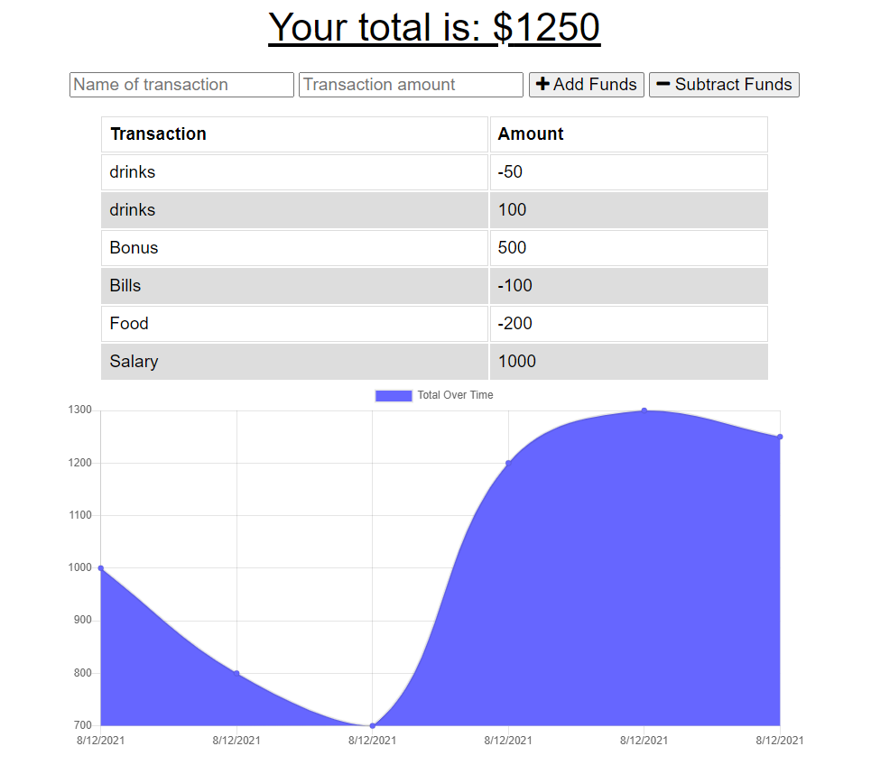

# 19 - Budget-Tracker

## Description
 This weeks assignment is to refactor code and to add an off-line feature to the Budget Tracker, which allows users to input withdrawel/deposit to the Application without internet connection.
 
## Usage

 The application allow users to:
 
 * Enter transactions offline.
 * Populate total expenditure.
 * Monitor expenses from a graph that plots the dates overtime.

## Installation 

- Clone repository to your local machine.
- Input `npm i` to install node packages [Express,Mongoose,Morgan,NodeMon,Lite-Server] for the Application.
- Input `npm run start` to run the Application.

## Link to deployed Application on Heroku
 [Click Here](https://budget-tracker-marcus.herokuapp.com/)
 
## Link to Github repository
[Click Here](https://github.com/marcuslau0903/19-Budget-tracker)

## ScreenShots for the Budget-Tracker

